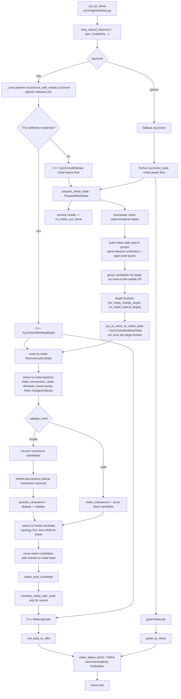
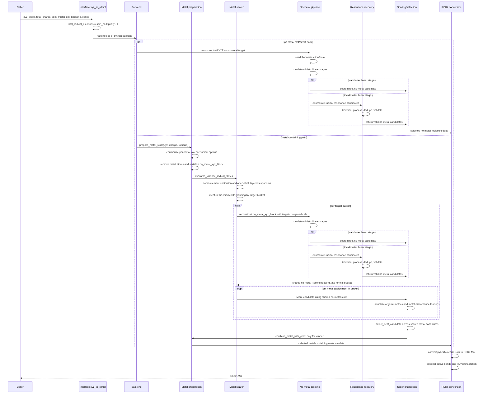

# MolGR Algorithm Architecture

[English](ALGORITHM_ARCHITECTURE.md) | [中文](ALGORITHM_ARCHITECTURE.zh-CN.md)

This document describes the current MolGR algorithm architecture as implemented
today. It covers the public `xyz_to_rdmol(...)` entrypoint in
[`src/molgr/interface.py`](../../src/molgr/interface.py), the Python fallback semantic reference, and the C++
`_core` acceleration backend.

Current status:

- the default backend is `backend="cpp"`
- the public API is still unified at `xyz_to_rdmol(...)`
- the Python fallback is the semantic reference
- the C++ backend mirrors the same algorithmic layering and accepts runtime
  `MolGRConfig`
- both backends return RDKit `Chem.Mol` after a backend-specific conversion step
- metal-containing inputs use a shared two-stage architecture:
  reconstruct the metal-free organic core first, then select metal states, and
  only reinsert metals for the final winner

## Unified Architecture

The current algorithm can be read as seven layers:

1. API normalization
   - `xyz_to_rdmol(xyz_block, total_charge, spin_multiplicity, backend, config)`
   - normalize `spin_multiplicity` into `total_radical_electrons = spin_multiplicity - 1`
   - resolve config and route to Python or C++

2. Backend execution boundary
   - Python: `molgr.fallback.pipeline.reconstruct_with_metals.xyz2omol(...)`
   - C++: `molgr._core.pipeline.reconstruct_with_metals.xyz2omol(...)`
   - the C++ binding releases the GIL and converts Python config into C++ config

3. Metal-aware orchestration
   - read XYZ
   - enumerate per-metal `(valence, radical_num)` candidates
   - strip metals and build `no_metal_xyz_block`
   - compress metal combinations into no-metal target buckets:
     `(no_metal_charge_target, no_metal_radical_target)`

4. Metal-free reconstruction
   - seed a `ReconstructionState`
   - run the deterministic linear pipeline
   - if valid, clean and score directly
   - if invalid, enter radical resonance recovery

5. Resonance recovery
   - traverse candidates using configured resonance depth and traversal policy
   - run `process_resonance`
   - deduplicate with processed resonance keys
   - keep only candidates that match the charge/radical target
   - choose the best no-metal candidate by organic topology first, then force-field score

6. Metal candidate scoring and selection
   - each no-metal target bucket is reconstructed once and shared by all metal assignments in that bucket
   - each metal candidate inherits the shared organic-core force-field score
   - selection compares metal-discordance count, then organic-core force-field score, then `combination_index`
   - only the final winner materializes metal reinsertion

7. RDKit output finalization
   - Python backend: `pybel_to_rdmol(...)`
   - C++ backend: `mol_data_to_rdkit(...)`
   - optional `make_dative_bond(...)`
   - final RDKit aromaticity, stereo, chirality, and CIP assignment

Key state objects:

- `ReconstructionState`: metal-free reconstruction state with molecule, targets, phase history, and score caches
- `MetalPreparationState`: stripped-metal input plus per-metal electronic-state options
- `MetalCandidateState`: one metal assignment and its induced no-metal target bucket, optionally bound to a shared `ReconstructionState`
- `MolGRConfig`: unified runtime config for force field, resonance, metal scoring, metal radical inference, and C++ backend switches

## Call Graph



## Data-Flow Sequence Diagram



## Metal-Free Linear Pipeline

The deterministic metal-free stage order is aligned between
[`src/molgr/fallback/utils/no_metals/preparation.py`](../../src/molgr/fallback/utils/no_metals/preparation.py)
and the corresponding C++
implementation:

1. `make_connections`
2. `pre_clean`
3. `fresh_omol_charge_radical_initial`
4. initialize the residual charge budget
5. run the eliminate/clean sequence for NNN, high positive centers, ambiguous CN,
   carboxyl, carbene-adjacent cases, neighboring radicals, and charge splitting
6. `break_deformed_ene`
7. `break_one_bond`
8. `fresh_omol_charge_radical_final`

If `validate_omol(...)` succeeds after the linear pipeline, the flow goes
straight to `clean_resonances` and scoring. Otherwise it enters resonance
recovery.

## Resonance Recovery

Resonance recovery is only used when the linear metal-free pipeline does not
produce a valid target.

Current behavior:

- build a resonance state key and bond index map
- enumerate one-step radical resonance moves
- choose traversal ordering from config:
  - `direct_gain`
  - `force_field`
  - `input_order`
- by default, use limited-discrepancy traversal
- run `process_resonance` on each candidate and deduplicate by processed key
- keep only candidates that satisfy `validate_omol(...)`
- select the best no-metal candidate by:
  1. more aromatic atoms
  2. larger maximum conjugated component
  3. more conjugated atoms
  4. more conjugated bonds
  5. lower force-field score

## Metal Search and Selection

The metal-aware pipeline does not enumerate the full Cartesian product and then
score everything. It compresses the search space first.

### Metal-state enumeration

For each atom that OpenBabel classifies as a metal:

- fetch candidate valences from `METAL_VALENCE_AVAILABLE_PRIOR` and `METAL_VALENCE_AVAILABLE_MINOR`
- infer plausible radical counts from local coordination environment
- build `MetalAtomPosition(idx, symbol, element_idx, valence, radical_num, xyz)`
- remove the metal atom from the organic-core reconstruction path

`metal_radical_inference` is heuristic and does not collapse each valence to a
single spin state:

- first estimate the post-oxidation shell occupation from the element's nominal
  `f/d/s/p` electrons and the candidate valence; d-block metals may relax
  residual `s/p` electrons into the d shell up to `d10`
- then collect nearby donors inside the cutoff, estimate coordination number,
  geometry, and donor field score, and record the field label as `strong`,
  `weak`, or `intermediate` for analysis
- because the strong/weak field thresholds are not decisive enough, radical
  candidates keep both the low-spin and high-spin ends of the free-ion `d^n`
  table except for hard geometry rules such as square-planar `d8/d7/d9` and
  tetrahedral environments
- this prevents a weak-field label from dropping possible strong-field
  low-spin states, and prevents a strong-field label from dropping possible
  weak-field high-spin states; metal search and no-metal target validation then
  decide which combinations are feasible

### Search-space compression

The current pipeline compresses metal combinations in three steps:

- same-element multimetal unification
- open-shell layered search
- meet-in-the-middle DP over partial assignments

The DP result is grouped by:

```text
(no_metal_charge_target, no_metal_radical_target)
```

So different metal assignments that induce the same metal-free target only pay
for one metal-free reconstruction.

### Metal candidate scoring

Each `MetalCandidateState` is scored after attaching a shared
`ReconstructionState`. Candidate selection uses:

- the shared organic-core force-field score
- metal-discordance features derived from organic electronic-state metrics:
  - aromatic atoms and rings
    - aromatic rings are first marked by OpenBabel and then filtered: if the
      absolute value of the formal-charge sum over the ring is at least 4, the
      ring does not count as aromatic and does not contribute aromatic atoms
    - this prevents heavily charge-separated rings from being treated as
      aromatic only because they formally satisfy a `4n+2` electron count, so
      aromatic-ring loss can contribute to discordance scoring
  - conjugated atoms and bonds
  - maximum conjugated component size
  - charge localization penalty
  - radical localization penalty
- local metal-coordination discordance checks based on inner-sphere visibility,
  formal charge signs, visible diradicals, and charge-balance exceptions

### Metal candidate discordance features

Discordance features identify chemically incoherent organic-metal combinations
induced by an incorrect metal-valence candidate. The algorithm does not use
discordance features to adjust the current candidate's metal valence, because
the metal search has already enumerated the available valence candidates. The
correct-valence candidate should avoid these discordance features naturally.

Typical discordance structures to record:

1. Inner-sphere visible diradical atom
   - the atom is inside the metal coordination radius, defined as
     `metal covalent radius + atom covalent radius + metal_coordination_extra_tolerance_angstrom`;
     the default extra tolerance is `0.35 Å`.
   - RDKit post-processing dative-bond completion uses the same
     `metal_coordination_extra_tolerance_angstrom` setting, keeping
     inner-/outer-sphere classification and final dative-bond completion on the
     same distance criterion.
   - the coordination path from the metal center to the atom is visible and not
     blocked by other atoms; visibility is a second dimension separate from the
     inner/outer distance test
   - the atom appears as a diradical in the current candidate
   - an isolated oxygen atom is the typical example
   - chemical meaning: this is usually not a plausible neutral diradical ligand,
     but an unrecognized inner-sphere `O^2-`-like coordination structure under
     the wrong valence candidate
   - selection role: mark local metal-coordination electronic discordance for
     the current candidate; do not modify that candidate's metal valence

2. Outer-sphere or invisible adjacent double charge
   - the organic part contains adjacent double negative charges or adjacent
     double positive charges
   - unless both charged sites are visible inner-sphere atoms, the pair is
     treated as discordant
   - visible inner-sphere atoms are not an unconditional exemption: adjacent
     same-sign carbon ions (`C-`/`C-` or `C+`/`C+`) still count as discordant
     even when both atoms are visible inner-sphere atoms; two visible
     inner-sphere same-sign carbon ions bridged by one conjugated double bond,
     such as `C-–C=C–C-` or `C+–C=C–C+`, also count as discordant
   - the same-sign adjacent charges look like a `pi` electron pair forcibly
     separated under the wrong metal-valence assumption, rather than a stable
     local coordination or delocalization pattern; adjacent inner-sphere
     or short-conjugated same-sign carbon ions (`C-`/`C-` or `C+`/`C+`) are
     common in organometallic `pi` coordination intermediates or the reverse
     charge-assignment form, and should not be treated as ordinary isolated
     coordinating charges
   - chemical meaning: the current candidate has pushed a two-electron
     metal-ligand-system assignment into the organic part, creating abnormal
     compensating charge separation
   - selection role: mark organic `pi` electron assignment discordance for the
     current candidate; do not modify that candidate's metal valence

3. Inner-sphere visible coordinating atom with repulsive formal charge
   - the atom is inside the metal coordination radius, using the same covalent
     radius sum plus additive tolerance definition
   - the coordination path from the metal center to the atom is visible and not
     blocked by other atoms
   - when the metal formal valence in the current candidate is nonzero, the atom
     has a nonzero formal charge with the same sign as that metal valence
   - when the metal formal valence in the current candidate is zero, a positive
     formal charge on the visible inner-sphere atom also counts as this
     discordance feature
   - chemical meaning: a visible inner-sphere coordination site should provide
     electrostatic or donor support compatible with the metal valence; same-sign
     formal charge repels a nonzero metal-valence candidate, while a positive
     inner-sphere charge around a zero-valence metal leaves an electron-deficient
     coordination center in the organic inner sphere
   - selection role: mark inner-sphere coordination electrostatic discordance
     for the current candidate; do not modify that candidate's metal valence

4. Organic cation under an all-zero-valence metal assignment
   - if every metal in the current candidate has formal valence zero and the
     no-metal organic part contains any positively charged non-metal atom, the
     candidate receives one discordance count
   - the positive atom does not need to be inner-sphere or visible; this is a
     candidate-level global criterion
   - chemical meaning: when all metals are assigned zero valence, a remaining
     organic cation usually indicates that the candidate lacks a plausible
     metal-ligand charge-assignment source
   - selection role: mark global charge-assignment discordance between an
     all-zero-valence metal combination and an organic cation state

5. Negative-valence metal without an explicit charge-balance source
   - a negative formal valence on any metal in the current candidate is
     discordant by default
   - exception one: the no-metal structure contains an outer-sphere `H+`,
     meaning the positively charged hydrogen atom is outside the inner-sphere
     coordination radius of every current metal candidate; other outer-sphere
     organic cations no longer exempt a negative-valence metal
   - exception two: the current candidate also contains another positive-valence
     metal; this can provide metal-cation charge balance for the negative metal
     center
   - chemical meaning: isolated negative-valence metals are chemically unlikely
     for most candidates unless an explicit outer-sphere proton acid or a
     metal cation balances the charge
   - selection role: mark global charge-balance discordance for the current
     metal-valence candidate; do not remove the candidate directly

Final selection now keeps only discordance and the organic score:

- first attach the shared no-metal state to every metal candidate and compute
  the organic-core force-field score plus `metal_discordance_count`
- compare `metal_discordance_count` first and keep only candidates with the
  lowest discordance count
- if multiple candidates tie at the lowest discordance count, compare the
  organic-core force-field score directly
- if the organic score is still tied, use `combination_index` as a stable
  deterministic tie-breaker
- selected candidates still record organic electronic-state metrics used to
  derive discordance, but the removed metal-environment scoring metrics no
  longer exist in the runtime metadata

## Extra C++ Optimizations

The C++ backend now includes several optimizations beyond a direct translation
of the Python fallback:

1. Metal-free fast path
   - `XyzBlockIsDefinitelyMetalFree(...)` scans atom symbols in the XYZ block
   - confirmed metal-free inputs skip metal preparation and metal-state search

2. GIL release
   - the pybind entry releases the Python GIL around the C++ pipeline

3. Target-bucket parallelism
   - `enable_target_bucket_parallelism` is wired and enabled by default
   - independent no-metal target buckets can be reconstructed in parallel

4. Parallel DP frontier construction
   - when target-bucket parallelism is enabled and both halves are non-empty,
     the C++ meet-in-the-middle search builds one frontier with `std::async`

5. Parallel candidate scoring
   - `enable_candidate_scoring_parallelism` is wired but disabled by default
   - when enabled and the candidate count crosses
     `candidate_score_parallel_threshold`, candidate scoring runs in parallel

6. Preheated no-metal score bundle
   - `ReconstructionState::PreheatScoreBundle(...)` prepares and caches:
     - force-field score key
     - organic-core force-field score
     - post-reinsertion base components
     - force-field metadata
   - bucket-shared no-metal states can reuse this bundle across many candidates

7. Global force-field evaluation LRU
   - `ForceFieldEvaluationCache` is a thread-safe LRU keyed by structure,
     requested force field, and force-field config

8. UFF atom typing LRU
   - the C++ fork of `MolgrForceFieldUFF` supports cached atom typing
   - `enable_uff_atom_typing_cache` is enabled by default

9. Thread-local reusable force-field instances
   - each thread reuses force-field instances
   - exact and coarse setup keys guard against stale OpenBabel setup reuse

10. Copy-on-write OBMol state
    - `OmolStateMachine` stores `shared_ptr<OBMol>`
    - branches share state until mutation requires `EnsureUniqueMol()`

11. Topology-first resonance tie filtering
    - Python scores every valid resonance candidate before applying the final
      topology-and-score key
    - C++ first narrows candidates to the best topology class, then only scores
      ties
    - because force-field score is the last tie-breaker, this preserves the
      selection semantics while reducing force-field calls

12. Lightweight cross-language return type
    - the C++ backend returns `MoleculeData`, then Python converts to RDKit

13. Built-in timing instrumentation
    - `RunTimingReducer` records no-metal, resonance, metal enumeration, and
      force-field timing breakdowns for profiling

Implementation note:

- resonance-candidate parallelism was removed because scheduling overhead was
  higher than the benefit, so the current version no longer exposes C++ config
  fields for it
- `RecoverResonanceCandidates(...)` still prepares resonance candidates serially

## Maintenance Boundaries

When changing algorithmic behavior:

- if fallback semantics change, verify C++ parity, especially `test_cpp_*` files under
  [`tests/`](../../tests/) or related backend regression tests
- if C++ pipeline, bindings, or `_core` surface changes, rebuild the extension
  and run affected tests
- if `_core` exports change, regenerate `.pyi` stubs
- if config fields change, update both Python dataclasses and C++ config
  conversion/binding code
- if metal search changes, re-check target-bucket reuse, DP pruning,
  same-element unification, and open-shell layered behavior
