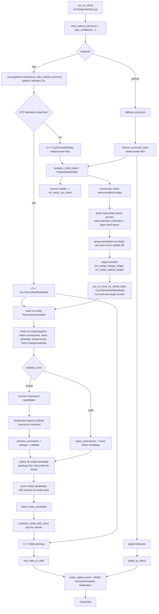
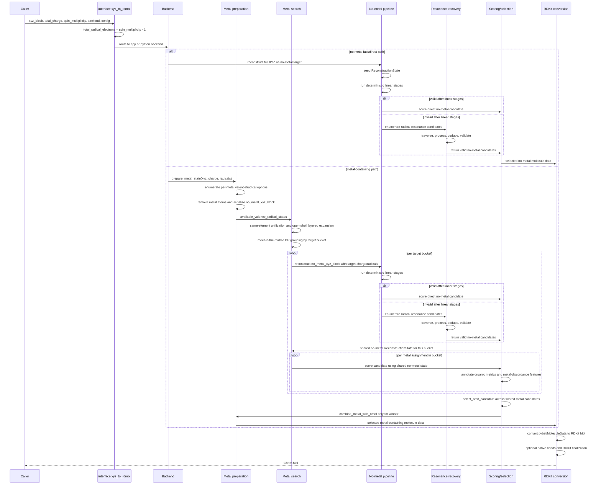

# MolGR 算法架构

[English](ALGORITHM_ARCHITECTURE.md) | [中文](ALGORITHM_ARCHITECTURE.zh-CN.md)

本文描述当前版本的 MolGR 算法架构。范围覆盖
[`src/molgr/interface.py`](../../src/molgr/interface.py) 暴露的
`xyz_to_rdmol(...)`，Python fallback 语义参考实现，以及 C++ `_core` 加速实现。

当前版本的核心状态：

- 默认后端是 `backend="cpp"`，入口仍统一在 `xyz_to_rdmol(...)`。
- Python fallback 是语义参考；C++ 后端复刻同一算法分层，并通过 `MolGRConfig` 接收运行时配置。
- 两个后端最终都回到 RDKit `Chem.Mol`：Python 后端先得到 `pybel.Molecule`，C++ 后端先得到
  `MoleculeData`，再由 `molgr.utils.converter` 转成 RDKit。
- 金属体系采用“先重建无金属有机骨架，再选择金属电子态，最后只为赢家回插金属”的统一架构。

## 统一架构

MolGR 的统一算法可以按七层理解：

1. API 归一化
   - `xyz_to_rdmol(xyz_block, total_charge, spin_multiplicity, backend, config)`
   - 将 `spin_multiplicity` 转换成 `total_radical_electrons = spin_multiplicity - 1`
   - 解析配置并路由到 Python 或 C++ 后端

2. 后端执行边界
   - Python：`molgr.fallback.pipeline.reconstruct_with_metals.xyz2omol(...)`
   - C++：`molgr._core.pipeline.reconstruct_with_metals.xyz2omol(...)`
   - C++ pybind 入口释放 GIL，并把 Python `MolGRConfig` 转成 C++ `MolGRConfig`

3. 金属感知编排
   - 读取 XYZ
   - 枚举每个金属原子的候选 `(valence, radical_num)`
   - 删除金属，得到 `no_metal_xyz_block`
   - 把金属态组合压缩成 no-metal 目标桶：`(no_metal_charge_target, no_metal_radical_target)`

4. 无金属重建
   - 从 no-metal XYZ 创建 `ReconstructionState`
   - 运行确定性线性 pipeline
   - 如果结构有效，直接清理、评分并返回候选
   - 如果结构无效，进入自由基共振恢复

5. 共振恢复
   - 按配置的 `resonance.max_depth` 和 `resonance.traversal_score` 遍历候选
   - 对候选执行 `process_resonance`
   - 用 processed resonance key 去重
   - 验证电荷和自由基数是否满足目标
   - 按有机拓扑和力场能量选择 no-metal 赢家

6. 金属候选评分和选择
   - 同一个 no-metal 目标桶只重建一次，然后共享给桶内所有金属态候选
   - 候选先继承共享有机骨架力场分数
   - 选择时依次比较金属失谐计数、有机骨架力场分数和 `combination_index`
   - 只为最终赢家执行金属回插

7. RDKit 输出后处理
   - Python 后端：`pybel_to_rdmol(...)`
   - C++ 后端：`mol_data_to_rdkit(...)`
   - 可选执行 `make_dative_bond(...)`
   - 设置隐式氢、芳香性、双键立体、手性和 CIP 标签

关键状态对象：

- `ReconstructionState`：无金属重建状态，包含 `omol`、目标电荷、目标自由基数、阶段历史和评分缓存。
- `MetalPreparationState`：金属剥离后的输入，包含 `no_metal_xyz_block` 和每个金属的候选电子态。
- `MetalCandidateState`：一个金属电子态组合及其诱导的 no-metal 目标桶，可绑定共享的 `ReconstructionState`。
- `MolGRConfig`：统一运行时配置，包含 force-field、resonance、metal scoring、metal radical inference 和 C++ 后端开关。

## 调用图



## 数据流动时序图



## 无金属线性 Pipeline

无金属重建的确定性阶段由
[`src/molgr/fallback/utils/no_metals/preparation.py`](../../src/molgr/fallback/utils/no_metals/preparation.py)
和 [`src/cpp/src/utils/no_metals/preparation.cpp`](../../src/cpp/src/utils/no_metals/preparation.cpp)
对齐实现。主要顺序是：

1. `make_connections`
2. `pre_clean`
3. `fresh_omol_charge_radical_initial`
4. 初始化剩余电荷预算：目标总电荷减去当前原子形式电荷
5. 依次执行 NNN、强正电中心、CN 疑难键、羧基、卡宾邻位、邻位自由基、电荷分离等消除/清理阶段
6. `break_deformed_ene`
7. `break_one_bond`
8. `fresh_omol_charge_radical_final`

线性阶段后如果 `validate_omol(...)` 满足目标电荷和自由基数，则直接进入 `clean_resonances` 和评分。
否则进入共振恢复。

## 共振恢复策略

共振恢复只在无金属线性阶段不能直接得到有效结构时触发。当前策略是：

- 构建 resonance state key 和 bond index map。
- 枚举一步自由基共振迁移。
- 使用配置选择 traversal policy：
  - `direct_gain`
  - `force_field`
  - `input_order`
- 默认使用 limited-discrepancy traversal，限制偏离最高优先级迁移的总 discrepancy。
- 对每个候选执行 `process_resonance`，再构建 processed resonance key 去重。
- 只保留通过 `validate_omol(...)` 的候选。
- no-metal 候选选择优先级是：
  1. 更多芳香原子
  2. 更大的最大共轭连通分量
  3. 更多共轭原子
  4. 更多共轭键
  5. 更低 force-field 分数

## 金属搜索与选择

金属路径的关键不是直接枚举所有金属态笛卡尔积，而是先压缩搜索空间。

### 金属态枚举

对每个 OpenBabel 识别为 metal 的原子：

- 从 `METAL_VALENCE_AVAILABLE_PRIOR` 和 `METAL_VALENCE_AVAILABLE_MINOR` 获取候选价态。
- 使用 `metal_radical_inference` 根据局部配位环境推断可能的金属自由基数。
- 生成 `MetalAtomPosition(idx, symbol, element_idx, valence, radical_num, xyz)`。
- 删除金属原子，生成后续共享的 `no_metal_xyz_block`。

`metal_radical_inference` 的自由基数推断是启发式，不直接决定唯一自旋态：

- 先按元素的 nominal `f/d/s/p` 电子数和候选价态估算氧化后的壳层占据；d-block 金属允许残余 `s/p` 电子并入 d 壳层至多到 `d10`。
- 再收集金属周围 cutoff 内最近 donor，估计配位数、几何类型和 donor field score，并把场强标记为 `strong`、`weak` 或 `intermediate` 供分析。
- 由于强/弱场阈值本身不够可靠，除 square-planar `d8/d7/d9` 和 tetrahedral 这类几何硬规则外，候选自由基数会同时保留自由离子 `d^n` 表中的低自旋端和高自旋端。
- 这样弱场判定不会丢掉可能的强场低自旋候选，强场判定也不会丢掉可能的弱场高自旋候选；后续金属搜索和 no-metal 目标桶筛选再决定哪些组合可行。

### 搜索空间压缩

金属候选组合经过三层压缩：

- same-element multimetal unification：当同元素金属数量超过阈值时，优先把同元素金属统一到共同的 `(valence, radical)` 签名。
- open-shell layered search：开壳层多金属体系按候选价态先验惩罚分层，先尝试更可信的层，只有当前层没有有效候选才进入下一层。
- meet-in-the-middle DP：把金属组拆成左右两半，分别枚举并剪枝 partial assignment，再合并成 no-metal 目标桶。

DP 合并后的 target bucket key 是：

```text
(no_metal_charge_target, no_metal_radical_target)
```

这意味着多个不同金属态组合如果诱导相同的无金属目标，只会触发一次无金属重建。

### 金属候选评分

每个 `MetalCandidateState` 绑定一个共享的 `ReconstructionState` 后评分。候选选择使用：

- 共享有机骨架 force-field score。
- 由有机电子态指标派生的金属失谐特征：
  - 芳香原子/环数量
    - 芳香环先由 OpenBabel 标记，再额外过滤：如果环上形式电荷之和的绝对值大于等于 4，该环不计入芳香环，也不贡献芳香原子数。
    - 该过滤避免高度电荷分离的环仅因形式上满足 `4n+2` 电子数而被当成芳环，从而让芳环损失进入失谐度判定。
  - 共轭原子/键数量
  - 最大共轭连通分量
  - 电荷局域化惩罚
  - 自由基局域化惩罚
- 局部金属配位失谐检查：基于内圈可见性、形式电荷符号、可见双自由基和电荷平衡例外。

### 金属候选失谐结构特征

失谐结构用于识别错误金属价态候选诱导出的不协调有机-金属组合。算法不会根据失谐结构反向调整当前候选的金属价态，因为金属搜索已经枚举了所有可用价态；正确价态对应的候选应当不会出现这些失谐特征。

当前需要记录的典型失谐结构包括：

1. 内圈可见双自由基原子
   - 原子位于金属内圈配位半径内；配位半径定义为 `中心金属共价半径 + 该原子共价半径 + metal_coordination_extra_tolerance_angstrom`，默认冗余值为 `0.35 Å`。
   - RDKit 后处理补配位键也使用同一个 `metal_coordination_extra_tolerance_angstrom`，保持内外圈判定和最终配位键补全的距离判据一致。
   - 从金属中心到该原子的配位路径可见，未被其它原子遮挡；可见性是独立于内外圈距离判定的第二个维度。
   - 该原子在当前候选中表现为双自由基。
   - 典型例子是孤立氧原子。
   - 化学含义：这类结构通常不是合理的中性双自由基配体，而是错误价态候选下未被识别的内圈配位 `O^2-` 型结构。
   - 判定作用：标记当前金属价态候选与局部配位电子结构失谐；不修改该候选的金属价态。

2. 外圈或不可见邻位双电荷
   - 有机部分出现邻位双负电荷或邻位双正电荷。
   - 除非这两个带电原子都属于内圈可见原子，否则该邻位双电荷对记为失谐。
   - 内圈可见原子并非全部豁免：两个相邻同号碳离子（`C-`/`C-` 或 `C+`/`C+`）即使都在内圈且可见，也计为失谐结构；如果两个内圈可见同号碳离子之间存在一个双键共轭桥，例如 `C-–C=C–C-` 或 `C+–C=C–C+`，同样计为失谐结构。
   - 这里的“同号/异号”如果需要进一步分类，是相对于最近中心金属候选价态的符号，而不是相对于 no-metal 目标桶的总电荷状态。
   - 两个邻位同号电荷更像是在错误金属价态预设下被强行分离的 `pi` 电子对，而不是稳定的局部配位或离域结果；内圈相邻或短程共轭的同号碳离子（`C-`/`C-` 或 `C+`/`C+`）常见于金属有机中间体中的 `pi` 电子配位或其逆向电荷分配，不能当成普通孤立配位电荷豁免。
   - 化学含义：这类结构通常说明当前候选把金属-配体整体的二电子分配压到了有机部分，形成补偿性的异常电荷分离。
   - 判定作用：标记当前金属价态候选与有机 `pi` 电子分配失谐；不修改该候选的金属价态。

3. 内圈可见配位原子的排斥性形式电荷
   - 原子位于金属配位半径内；配位半径使用同样的共价半径和加性冗余定义。
   - 从金属中心到该原子的配位路径可见，未被其它原子遮挡。
   - 当当前候选中的金属形式价态非零时，该原子具有非零形式电荷，且形式电荷符号与金属价态符号相同。
   - 当当前候选中的金属形式价态为 0 时，内圈可见原子带正形式电荷也计为该类失谐结构。
   - 化学含义：可见内圈配位位点通常应当提供与金属价态相容的静电或 donor 支持；非零价金属的同号形式电荷表示局部配位环境与当前金属价态候选相互排斥，零价金属内圈正电则表示候选把缺电子配位中心留在了有机内圈。
   - 判定作用：标记当前金属价态候选与内圈配位静电环境失谐；不修改该候选的金属价态。

4. 全零价金属候选中的有机阳离子
   - 当前候选中所有金属形式价态都为 0，且 no-metal 有机部分存在任意正形式电荷非金属原子时，计为 1 个失谐结构。
   - 该规则不要求正电原子位于内圈或可见；它是候选级全局判据。
   - 化学含义：如果所有金属都被设为零价，有机部分残留正电荷通常表示候选没有提供合理的金属-配体电荷分配来源。
   - 判定作用：标记零价金属组合与有机阳离子状态的全局电荷分配失谐。

5. 缺少电荷平衡来源的负价金属
   - 当前候选中出现负形式价态金属时，默认计为失谐结构。
   - 例外一：no-metal 结构中存在外圈 `H+`，即带正电的氢原子不在任何当前金属候选的内圈配位半径内；其它外圈有机阳离子不再豁免负价金属。
   - 例外二：当前候选中同时存在其它正价金属；此时可解释为金属阳离子对负价金属中心的电荷平衡，允许负价金属候选。
   - 化学含义：孤立负价金属在绝大多数普通候选中不合理，除非体系中有明确的外圈质子酸或金属阳离子提供整体电荷平衡。
   - 判定作用：标记当前金属价态候选的全局电荷平衡失谐；不直接删除该候选。

最终选择只保留失谐度和有机分：

- 对每个金属候选先绑定共享 no-metal state，计算有机骨架 force-field score 和 `metal_discordance_count`。
- 先比较 `metal_discordance_count`，只保留失谐计数最低的候选。
- 如果多个候选并列最低失谐计数，则直接比较有机骨架 force-field score。
- 如果有机分仍然并列，则按 `combination_index` 做稳定的确定性打破平局。
- 入选候选仍会记录用于派生失谐度的有机电子态指标；已移除的金属环境评分指标不再存在于运行时 metadata。

## C++ 后端已实现的额外优化

C++ 后端当前不仅是 Python fallback 的逐行翻译，还实现了以下额外优化：

1. 无金属输入快路径
   - `XyzBlockIsDefinitelyMetalFree(...)` 只扫描 XYZ atom symbol。
   - 如果确认无金属，直接进入 `XyzToOmolNoMetalState(...)`，跳过金属剥离和金属态搜索。

2. GIL 释放
   - pybind 入口在调用 C++ pipeline 时释放 Python GIL。
   - 长时间运行的重建、搜索和 force-field 计算不会阻塞其他 Python 线程。

3. 目标桶并行
   - `enable_target_bucket_parallelism` 默认开启。
   - 每个 no-metal target bucket 独立重建，可通过 `ParallelForIndices(...)` 并行执行。
   - 并行度由硬件线程数、任务数和 `cpp_backend.max_threads` 共同限制。

4. DP frontier 并行
   - C++ `GroupCandidatesByTargetDp(...)` 在目标桶并行开启且左右 frontier 都非空时，用 `std::async` 并行构建一侧 partial assignment frontier。
   - 这加速了多金属体系的 meet-in-the-middle 前半段。

5. 候选评分并行
   - `enable_candidate_scoring_parallelism` 已接入，但默认关闭。
   - 当开启且候选数达到 `candidate_score_parallel_threshold` 时，桶内金属候选评分可并行执行。

6. no-metal score bundle 预热
   - C++ `ReconstructionState::PreheatScoreBundle(...)` 会一次性准备：
     - force-field score key
     - 有机骨架 force-field 分数
     - post-reinsertion base components
     - force-field 配置元数据
   - 金属桶内多个候选共享同一个 no-metal state 时，可以避免重复构建这些派生数据。

7. 全局 force-field evaluation LRU
   - `ForceFieldEvaluationCache` 使用线程安全 LRU，key 包含分子结构、请求的 force field 和 force-field 配置。
   - 相同结构重复评分时可直接复用 `ForceFieldEvaluation`。

8. UFF atom typing LRU
   - C++ fork 的 `MolgrForceFieldUFF` 支持 atom typing cache。
   - `enable_uff_atom_typing_cache` 默认开启。
   - 这减少了大量相似候选重复执行 UFF atom type assignment 的成本。

9. thread-local force-field 实例复用
   - 每个线程维护可复用的 force-field 实例。
   - C++ 使用 exact setup key 和 OpenBabel setup key 判断何时需要重置实例，避免 OpenBabel 粗粒度 setup 判断遗漏图/电荷变化。

10. C++ state copy-on-write
    - `OmolStateMachine` 使用 `shared_ptr<OBMol>`。
    - 分支时如果没有替换 molecule，会共享对象和缓存；真正修改时通过 `EnsureUniqueMol()` 复制。
    - 共振分支和候选状态传递减少了不必要的 OBMol 拷贝。

11. no-metal 共振候选的拓扑优先评分
    - Python fallback 会给每个有效共振候选评分后用拓扑和 score 组成 selection key。
    - C++ 先找最优拓扑候选集合，只对拓扑并列者执行 force-field 评分。
    - 由于 force-field score 在 no-metal selection key 中排最后，这保持选择语义，同时减少 force-field 调用。

12. C++ 输出 `MoleculeData`
    - C++ 后端返回轻量 `MoleculeData`，Python 层再转 RDKit。
    - 避免把 OpenBabel/Pybel 对象作为主要跨语言结果传递。

13. 运行时性能计时
    - C++ pipeline 有 `RunTimingReducer`，记录 no-metal pipeline、resonance、metal enumeration、force-field key/setup/energy 等耗时。
    - 这不是选择语义的一部分，但用于定位 C++ 加速路径中的热点。

实现状态说明：

- resonance candidate parallelism 的调度成本高于收益，当前版本不再保留对应 C++ 配置项。
- `RecoverResonanceCandidates(...)` 仍按串行流程准备 resonance candidates。

## 维护边界

修改算法时应按以下边界验证：

- 修改 fallback 语义：需要确认 C++ parity，尤其是 [`tests/`](../../tests/) 中的
  `test_cpp_*` 或相关后端回归测试。
- 修改 C++ pipeline、bindings 或 `_core` 暴露面：先重建扩展，再运行受影响测试。
- 修改 `_core` surface：同步生成 `.pyi` stub。
- 修改 force-field、resonance、metal scoring 配置：同时检查 Python dataclass、C++ config struct、`FromPython(...)` 和绑定导出。
- 修改金属搜索：重点检查 target bucket 复用、DP 剪枝、same-element unification 和 open-shell layered search 的行为是否仍一致。
