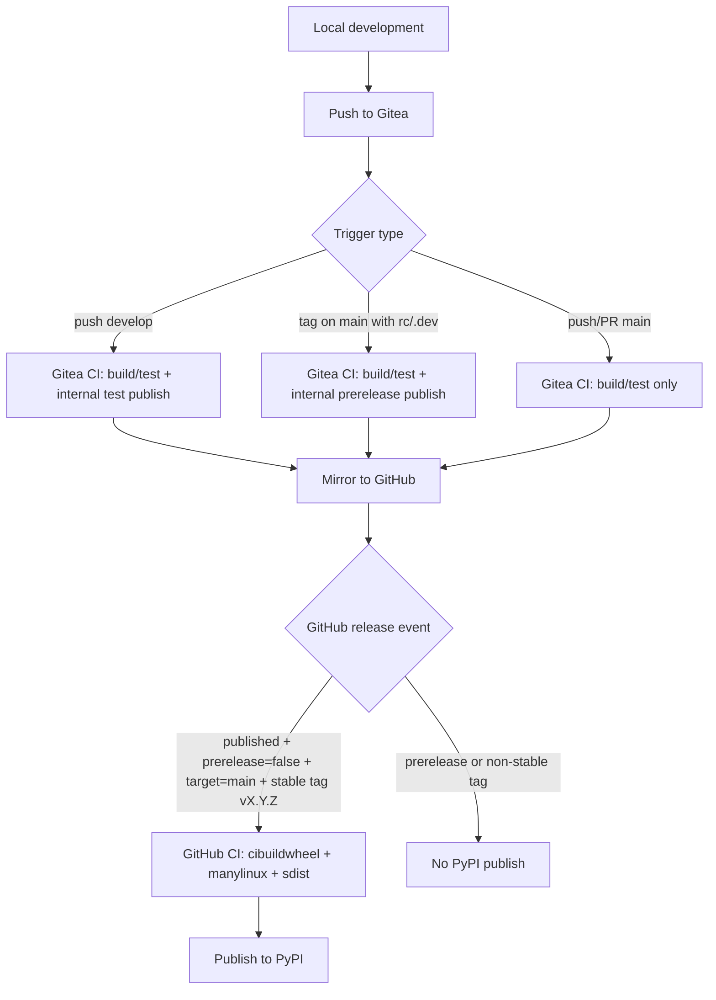

# Development and Release Guide

This project uses a three-channel release model:

1. `develop` pushes publish internal test packages in Gitea.
2. `main` prerelease tags (`rc` / `.dev`) publish internal prerelease packages in Gitea.
3. Stable GitHub Release from `main` stable tag publishes official packages to PyPI.

## Release Flow Diagram

## CI Roles

### Gitea workflow

File: `.gitea/workflows/ci.yaml`

- Linux matrix compile/test for Python `3.8` to `3.14`.
- Dependency index uses intranet mirror `https://mirrors.zju.edu.cn/pypi/web/simple`.
- Registry base URL is read from repository variable `SERVER_URL`.
- Publish to internal registry when either condition is met:
  - `push` to `develop` (test packages), or
  - `push` tag `v*` with `rc` or `.dev` from `main` (prerelease packages).

### GitHub workflow

File: `.github/workflows/ci.yaml`

- Cross-platform verification job (`build-and-test`) for `3.8` to `3.14`.
- Formal release wheel job uses `cibuildwheel` with manylinux (`manylinux_2_28`).
- Deploy publishes to PyPI only when all are true:
  - `release.published`
  - `prerelease == false`
  - `target_commitish == main`
  - tag starts with `v`
  - tag does not contain `rc` / `.dev`

## Tag Synchronization Policy

Mirror is managed by Gitea project settings.

## Required Gitea Variables and Runner Settings

- Repository variable: `SERVER_URL`
  - Example: `https://gitea.example.com:13000`
  - Used to compose publish/check URLs for internal registry upload.
- Optional proxy variables (for intranet egress control):
  - `HTTP_PROXY`
  - `HTTPS_PROXY`
  - `NO_PROXY`
  - workflow also exports lowercase equivalents for tool compatibility.
- Repository secrets:
  - `OWNER`
  - `PASSWORD`
- Runner setting for action resolution:
  - workflow uses `actions/checkout@v6` (no hardcoded host)
  - ensure your runner is configured to resolve actions from your expected forge source (self-hosted Gitea or mirrored source) to avoid host/port coupling.

- With one-way mirror `Gitea -> GitHub`:
  - tags created in local/Gitea sync to GitHub,
  - tags created only in GitHub do not sync back automatically.

Recommended operation:

1. Create tags in local/Gitea first.
2. Let mirror sync tags to GitHub.
3. Create GitHub Release from the synced stable tag.

## Operating Procedure

1. Develop on feature branches.
2. Merge to `develop` for continuous internal test-package publishing.
3. Merge to `main` after validation.
4. For internal prerelease package validation, tag `main` with `vX.Y.ZrcN` or `vX.Y.Z.devN`.
5. For formal release, tag `main` with stable `vX.Y.Z` and publish a non-prerelease GitHub Release.
6. Verify PyPI artifacts and GitHub Release assets after deploy.

## Guardrails

- `main` branch pushes must not publish internal test packages directly.
- Use `develop` for continuous internal test package channel.
- Use `main` prerelease tags for internal prerelease channel.
- Use stable `vX.Y.Z` tags for formal release only.
