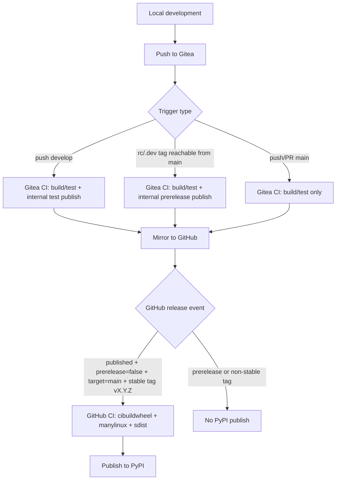

# Development and Release Guide

[English](DEVELOPMENT_RELEASE_GUIDE.md) | [中文](DEVELOPMENT_RELEASE_GUIDE.zh-CN.md)

This project uses a three-channel release model:

1. Pushes to `develop` publish internal test packages in Gitea.
2. Prerelease tags on `main` (`rc` / `.dev`) publish internal prerelease packages in Gitea.
3. Stable GitHub Releases from stable `main` tags publish official packages to PyPI.

## Release Flow Diagram

## CI Roles

### Gitea workflow

File: [`.gitea/workflows/ci.yaml`](../../.gitea/workflows/ci.yaml)

- Linux matrix compile/test for Python `3.8` to `3.14`.
- Dependency index uses intranet mirror
  [`https://mirrors.zju.edu.cn/pypi/web/simple`](https://mirrors.zju.edu.cn/pypi/web/simple).
- Internal wheel publishing uses the same Linux `cibuildwheel` split as GitHub:
  - `cp38`-`cp312`: `manylinux2014` / glibc `>=2.17`, `x86_64` and `aarch64`.
  - `cp313`-`cp314`: `manylinux_2_28`, `x86_64` and `aarch64`.
- Registry base URL is read from repository variable `SERVER_URL`.
- Publish to the internal registry when either condition is met:
  - `push` to `develop` (test packages), or
  - `push` tag `v*` with `rc` or `.dev`, validated as reachable from `main`
    (prerelease packages).

### GitHub workflow

File: [`.github/workflows/ci.yaml`](../../.github/workflows/ci.yaml)

- Cross-platform verification job (`build-and-test`) for `3.8` to `3.14`.
- Benchmark dependencies live in [`benchmarks/pyproject.toml`](../../benchmarks/pyproject.toml) and are intentionally excluded from root package metadata and release dependency resolution.
- Formal release wheel job uses `cibuildwheel` with platform-specific wheel groups:
  - Linux `cp38`-`cp312`: `manylinux2014` / glibc `>=2.17` for `x86_64` and `aarch64`.
  - Linux `cp313`-`cp314`: `manylinux_2_28` / glibc `>=2.28` for `x86_64` and `aarch64`.
  - Windows: AMD64.
  - macOS: native `x86_64` on `macos-13` and native `arm64` on `macos-14`.
- Runtime dependency metadata keeps `rdkit>=2023.9.6` unpinned so modern systems can install newer RDKit wheels, while older glibc systems can fall back to the newest compatible RDKit wheel available for their Python and platform. The root [`uv.lock`](../../uv.lock) is only the local development resolution and may choose older RDKit for some Python splits; it is not the published wheel's version cap.
- Deploy publishes to PyPI only when all are true:
  - `release.published`
  - `prerelease == false`
  - `target_commitish == main`
  - tag starts with `v`
  - tag does not contain `rc` / `.dev`

## Tag Synchronization Policy

Mirror is managed by Gitea project settings.

## Required Gitea Variables and Runner Settings

- Repository variable: `SERVER_URL`
  - Example: [`https://gitea.example.com:13000`](https://gitea.example.com:13000)
  - Used to compose publish/check URLs for internal registry upload.
- Optional proxy variables (for intranet egress control):
  - `HTTP_PROXY`
  - `HTTPS_PROXY`
  - `NO_PROXY`
  - set these on runner/service environment (recommended) instead of repository vars.
- Repository secrets:
  - `OWNER`
  - `PASSWORD`
Runner/action resolution:

- The current Gitea workflow uses `checkout@v6` from the configured internal action URL.
- Configure action source at Gitea server level, for example
  `DEFAULT_ACTIONS_URL=self` with mirrored actions, or `github` with outbound network.
- Action download happens before job steps, so proxy for action fetch must be configured on
  the runner/service environment.

With one-way mirror `Gitea -> GitHub`:

- tags created in local/Gitea sync to GitHub;
- tags created only in GitHub do not sync back automatically.

Recommended operation:

1. Create tags in local/Gitea first.
2. Let mirror sync tags to GitHub.
3. Create GitHub Release from the synced stable tag.

## Operating Procedure

1. Develop on feature branches.
2. Merge to `develop` for continuous internal test-package publishing.
3. Merge to `main` after validation.
4. For internal prerelease package validation, tag `main` with `vX.Y.ZrcN` or `vX.Y.Z.devN`.
5. For formal release, tag `main` with stable `vX.Y.Z` and publish a non-prerelease GitHub Release.
6. Verify PyPI artifacts and GitHub Release assets after deploy.

## Guardrails

- `main` branch pushes must not publish internal test packages directly.
- Use `develop` for continuous internal test package channel.
- Use `main` prerelease tags for internal prerelease channel.
- Use stable `vX.Y.Z` tags for formal release only.
