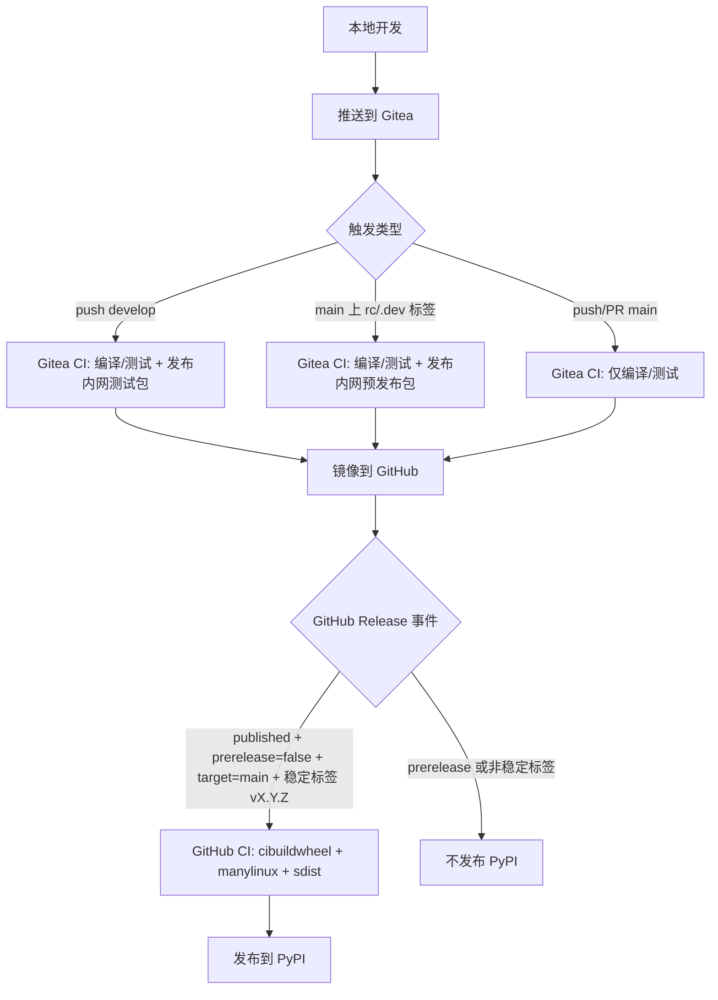

# 开发与发布指南

本项目采用三通道发布模型：

1. `develop` 分支提交，自动发布内网测试包（Gitea）。
2. `main` 分支上的预发布标签（`rc` / `.dev`），发布内网预发布包（Gitea）。
3. 基于 `main` 稳定标签创建 GitHub 正式 Release，发布 PyPI 正式包。

## 发布流程图

## CI 职责

### Gitea 工作流

文件：`.gitea/workflows/ci.yaml`

- Linux 矩阵编译/测试，覆盖 Python `3.8` 到 `3.14`。
- 依赖源使用内网镜像：`https://mirrors.zju.edu.cn/pypi/web/simple`。
- 仓库发布基地址来自仓库变量 `SERVER_URL`。
- 满足以下任一条件时发布内网仓：
  - `push` 到 `develop`（测试包通道）；
  - `main` 上 `v*` 标签且包含 `rc` 或 `.dev`（预发布通道）。

### GitHub 工作流

文件：`.github/workflows/ci.yaml`

- `build-and-test` 提供跨平台（Linux/macOS/Windows）验证，覆盖 `3.8` 到 `3.14`。
- 正式发布 wheel 使用 `cibuildwheel`，Linux 采用 manylinux（`manylinux_2_28`）。
- 仅在以下条件全部满足时发布 PyPI：
  - `release.published`
  - `prerelease == false`
  - `target_commitish == main`
  - 标签以 `v` 开头
  - 标签不包含 `rc` / `.dev`

## 标签同步策略

镜像方向由 Gitea 项目设置管理。

## 必要变量与 Runner 配置

- 仓库变量：`SERVER_URL`
  - 示例：`https://gitea.example.com:13000`
  - 用于拼接内网包仓发布/检查 URL。
- 可选代理变量（用于内网出网控制）：
  - `HTTP_PROXY`
  - `HTTPS_PROXY`
  - `NO_PROXY`
  - 建议在 runner/服务进程环境中设置，而不是仓库变量。
- 仓库密钥：
  - `OWNER`
  - `PASSWORD`
- Runner 的 action 解析配置：
- 工作流使用 `actions/checkout@v6` 以及标准 `uses:` action 引用。
- 需在 Gitea 服务端配置 action 来源（`DEFAULT_ACTIONS_URL=self` + 镜像 actions，或 `github` + 可出网）。
- action 下载发生在 job step 执行前，因此下载代理必须配置在 runner/服务进程环境层。

- 若为单向镜像 `Gitea -> GitHub`：
  - 本地/Gitea 创建的标签会同步到 GitHub；
  - 仅在 GitHub 创建的标签不会自动回流到 Gitea。

推荐操作：

1. 先在本地/Gitea 创建标签。
2. 等待镜像同步到 GitHub。
3. 基于同步后的稳定标签创建 GitHub Release。

## 推荐操作流程

1. 在功能分支开发。
2. 合并到 `develop` 触发内网测试包持续发布。
3. 验证通过后合并到 `main`。
4. 需要内网预发布验证时，在 `main` 打 `vX.Y.ZrcN` 或 `vX.Y.Z.devN` 标签。
5. 正式发布时，在 `main` 打稳定标签 `vX.Y.Z` 并创建非 prerelease 的 GitHub Release。
6. 发布完成后检查 PyPI 与 GitHub Release 产物。

## 约束与守则

- `main` 的普通提交不能直接发布内网测试包。
- `develop` 是持续内网测试包通道。
- `main` 的 `rc` / `.dev` 标签是内网预发布通道。
- 稳定标签 `vX.Y.Z` 仅用于正式发布。
